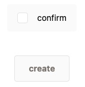
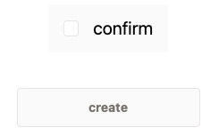
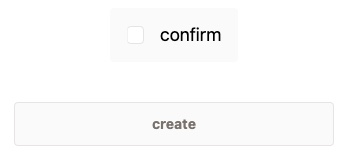
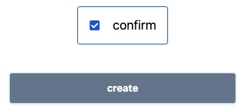
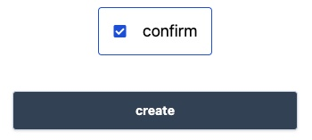
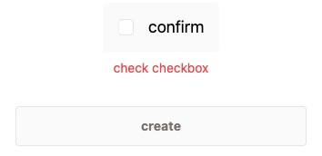

# 2023 fandnext interview

## HTML, CSS & Javascript

- 可自由調整更改 HTML 結構
- CSS：麻煩使用 TailwindCSS
- JavaScript：麻煩使用純 Javascript，不使用其他 library

1. 640px 以上的螢幕寬度 checkbox font-size 設為 `text-xl`，不滿 640px font-size 設為 `text-sm`
  - Example screen width 320px：`text-sm`

  

  - Example screen width 820px：`text-xl`

  

2. checkbox 新增 checked 狀態樣式

  - default 狀態

  

  - checked 狀態
    - border color: `border-blue-700`
    - text color: `text-blue-700`

  

3. 按鈕新增 hover 效果：background color: `bg-slate-700`

  

4. 用 checkbox 控制 button 的狀態和錯誤訊息顯示

  - checked status
    - button status enabled
    - add button enabled class: `btn-enabled`
    - hide error message：`check checkbox`

  

  - unchecked status
    - button status disabled
    - add button disabled class: `btn-disabled`
    - show error message：`check checkbox`

   

